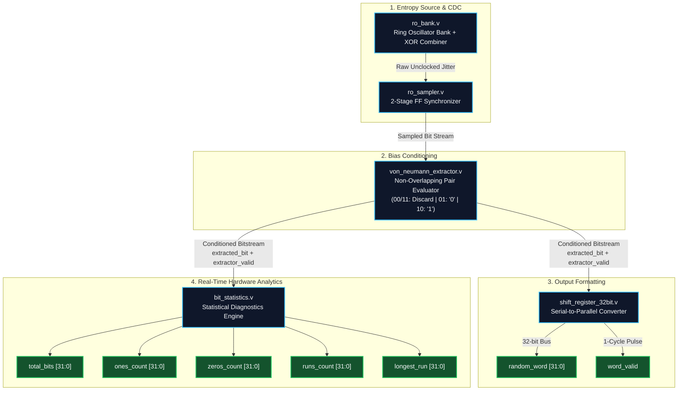

# FPGA True Random Number Generator (TRNG) Core with On-Chip Diagnostics

## Overview

This repository contains a lightweight, fully synthesizable Verilog-2001 True Random Number Generator (TRNG) IP core, designed for deployment on AMD/Xilinx FPGAs.

The core utilizes a Ring Oscillator (RO) bank combined via an XOR tree as a physical entropy source, exploiting semiconductor phase jitter. The raw entropy stream is safely sampled via a 2-stage synchronizer, conditioned via a mathematical Von Neumann Extractor (Non-Overlapping Pair Evaluator) to eliminate silicon bias, and formatted into a 32-bit parallel random word.

An integrated Real-Time Statistical Verification engine provides continuous on-chip health monitoring of the conditioned entropy stream through five 32-bit diagnostic counters.

## Architecture



## Key Features

* **Physical Jitter Entropy:** Multiple independent ring oscillators merged via an XOR combiner to harvest intrinsic phase jitter.
* **Metastability Protection:** 2-stage flip-flop synchronizer safely transitions asynchronous jitter into the system clock domain.
* **Bias Conditioning:** Non-overlapping pair Von Neumann Extractor guarantees a uniform probability distribution:
  * `00` $\rightarrow$ Discard
  * `11` $\rightarrow$ Discard
  * `01` $\rightarrow$ Output `0`
  * `10` $\rightarrow$ Output `1`
* **32-Bit Output Handshaking:** Formats conditioned bits into 32-bit words qualified by a single-cycle `word_valid` pulse.
* **Real-Time Hardware Analytics:** Integrated diagnostics engine monitors `extracted_bit` streams enabled by `extractor_valid`, outputting five 32-bit metrics (`total_bits`, `ones_count`, `zeros_count`, `runs_count`, `longest_run`).
* **Ultra-Lean Footprint:** Lightweight logic utilization suitable for embedded FPGA IP cores.

## Repository Layout

```text
fpga-trng-core/
├── rtl/
│   ├── trng_top.v                 # Top-level IP integration wrapper
│   ├── ro_bank.v                  # Ring oscillator bank + XOR combiner
│   ├── ro_sampler.v               # 2-stage flip-flop synchronizer
│   ├── von_neumann_extractor.v    # Non-overlapping pair bias corrector
│   ├── shift_register_32bit.v     # 32-bit serial-to-parallel converter
│   └── bit_statistics.v           # Real-time hardware analytics
├── tb/
│   ├── extractor_tb.v             # Extractor fault-model testbench
│   └── trng_top_tb.v              # Top-level simulation testbench
└── README.md
```

## Synthesis Metrics (Xilinx 7-Series)

Targeting Xilinx 7-Series FPGAs in AMD/Xilinx Vivado:

| Resource | Utilization Count | Available | Utilization % |
| :--- | :--- | :--- | :--- |
| **Slice LUTs** | **57** | 41,000 | < 0.2% |
| **Slice Registers (FFs)** | **268** | 82,000 | < 0.4% |
| **BUFGCTRL** | **1** | 32 | 3.1% |
| **Bonded IOBs** | **196** (6x32-bit diagnostics + control) | 300 | 65.3% |

*(Note on IOB Count: The 196 Bonded IOB pin count reflects exposing all diagnostic and output buses at the top level for hardware verification. In an integrated SoC, diagnostic buses route internally to system interconnects like AXI4-Lite).*

## Verification & Simulation

### Fault-Model Verification: `extractor_tb.v`

The conditioning pipeline was verified using a deliberate **~76% high-bias fault stream** injected into the extractor:

* **Raw Stream:** 100,000 bits injected with heavy high-state bias.
* **Conditioned Output:** The Von Neumann extractor discarded all non-matching pairs (`00` and `11`), yielding a conditioned bitstream with a **~50.0% / ~50.0% distribution** across all valid bits.
